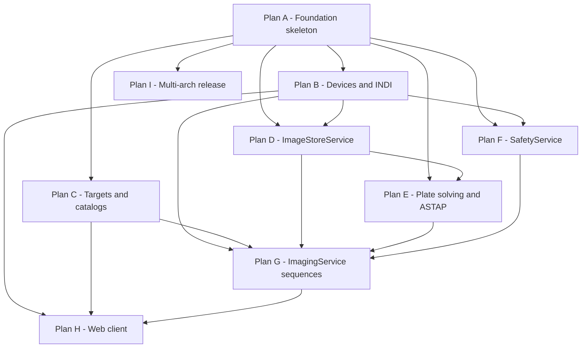

# NOCS v0.1 — Implementation plan decomposition

**Date:** 2026-04-22  
**Status:** Living document — update when a plan is written or completed.

**Purpose:** The [design spec](../specs/2026-04-21-nocs-v0.1-design.md) describes all of v0.1 at once. Implementation is split into **separate plans** so each slice produces **working, testable software on its own** (see the `writing-plans` skill scope check), without a single monolithic plan that blocks progress until every subsystem is stubbed.

---

## Plan overview (A–I)

| Plan | Name | Depends on | Demoable end state |
|------|------|------------|-------------------|
| **A** | Foundation & skeleton | — | `./bin/nocs` starts; `GET /api/config` and `GET /api/events` work; bearer auth enforced; CI builds a linux-x86_64 jlink archive. |
| **B** | Abstract device layer + INDI adapter | A | Drive INDI simulator drivers via HTTP end-to-end (mount/camera/filter wheel/focuser abstractions + `indiserver` supervision). Implemented: [2026-04-22-nocs-device-layer-and-indi.md](./2026-04-22-nocs-device-layer-and-indi.md). |
| **C** | Target service + catalogs | A | `GET /api/targets/search?q=M31` returns coordinates, altitude, transit, etc., using bundled catalogs + optional SIMBAD. Implemented: [2026-04-22-nocs-targets-and-catalogs.md](./2026-04-22-nocs-targets-and-catalogs.md). |
| **D** | ImageStoreService | A, B | After expose, FITS + thumbnail are saved and retrievable via `/api/images/*`. Implemented: [2026-04-22-nocs-image-store.md](./2026-04-22-nocs-image-store.md). |
| **E** | PlateSolvingService + ASTAP fetch-install | A, D | `solve(fits)` returns RA/Dec (or failure); optional auto-install of ASTAP + DB into `data_dir`. Implemented: [2026-04-22-nocs-plate-solving-and-astap.md](./2026-04-22-nocs-plate-solving-and-astap.md). |
| **F** | SafetyService | A, B | YAML rule engine + `POST /api/safety/e-stop`; simulated sensor event can trigger park / sequence abort per spec. Implemented: [2026-04-22-nocs-safety-service.md](./2026-04-22-nocs-safety-service.md). |
| **G** | ImagingService / sequence engine | B, C, D, E, F | Simulated end-to-end sequence: pre-steps, filter loop, dither, pause/abort/e-stop integration. |
| **H** | Web client | B, C, G (expand as backends land) | React + Vite + TS UI against the running server for all v0.1 views. |
| **I** | Multi-arch packaging & release | A | Release archives for linux-arm64 and windows-x86_64 (and polish multi-arch CI); envelope targets from spec §14. Implemented: [2026-04-22-nocs-multi-arch-release.md](./2026-04-22-nocs-multi-arch-release.md). |

---

## Dependency diagram

Plans **C**, **D**, **E**, and **F** can proceed in parallel once **A** (and **B** where noted) are in place; **G** waits for **B–F** and related services; **H** waits for core APIs; **I** extends packaging from **A**.

---

## Why this split

- **Demoable slices:** Each plan ends with something you can run and verify (tests, simulators, or curl), not a pile of stubs.
- **Spec-aligned boundaries:** Plans map to cohesive spec areas (interop §5, targets §9, imaging §10, plate solving §11, safety §6, UI §15, deployment §14).
- **Safety before full imaging:** **F** lands before **G** so sequence abort, e-stop, and rule triggers are real when the sequence engine ships.
- **Devices before FITS-heavy flows:** **B** precedes **D**/`G` because expose/save paths need device adapters.
- **Packaging split:** **A** proves jlink + one OS/arch in CI; **I** adds RPi/Windows archives without blocking feature work.

---

## Spec cross-reference (where each plan lands)

| Plan | Primary spec sections |
|------|------------------------|
| A | §4 HTTP layer, §7 auth, §8 REST/SSE/events, §12 persistence outline, §14 startup/packaging (subset), §17 testing/CI |
| B | §4 abstract devices, §5 INDI, §14 `indiserver` supervision |
| C | §9 targets & catalogs |
| D | §12 FITS on disk, §8 GET images |
| E | §11 plate solving |
| F | §6 safety model, §8 safety API |
| G | §10 imaging workflow |
| H | §15 web client |
| I | §14 deployment & packaging (multi-arch, envelope) |

---

## Current status

| Plan | Written? | Notes |
|------|----------|--------|
| A | Yes | [2026-04-22-nocs-foundation-skeleton.md](./2026-04-22-nocs-foundation-skeleton.md) |
| B | Yes | [2026-04-22-nocs-device-layer-and-indi.md](./2026-04-22-nocs-device-layer-and-indi.md) |
| C | Yes | [2026-04-22-nocs-targets-and-catalogs.md](./2026-04-22-nocs-targets-and-catalogs.md) |
| D | Yes | [2026-04-22-nocs-image-store.md](./2026-04-22-nocs-image-store.md) |
| F | Yes | [2026-04-22-nocs-safety-service.md](./2026-04-22-nocs-safety-service.md) |
| I | Yes | [2026-04-22-nocs-multi-arch-release.md](./2026-04-22-nocs-multi-arch-release.md) |
| E | Yes | [2026-04-22-nocs-plate-solving-and-astap.md](./2026-04-22-nocs-plate-solving-and-astap.md) |
| G | Yes | [2026-04-22-nocs-imaging-sequence-engine.md](./2026-04-22-nocs-imaging-sequence-engine.md) |
| H | No | Author with the `writing-plans` skill when starting that slice |

---

## How to pick the next plan

1. **Dependencies:** Use the table and diagram above — do not start **G** until **B–F** prerequisites for your chosen vertical are satisfied (or explicitly narrow scope for a spike).
2. **Spec drift:** Re-read [2026-04-21-nocs-v0.1-design.md](../specs/2026-04-21-nocs-v0.1-design.md); if the spec changed, adjust the slice before writing tasks.
3. **New plan doc:** Run the `writing-plans` skill for the chosen letter; save to `docs/superpowers/plans/YYYY-MM-DD-<feature-name>.md`.
4. **Execution:** Prefer `subagent-driven-development` or `executing-plans` against the written plan’s header instructions.
